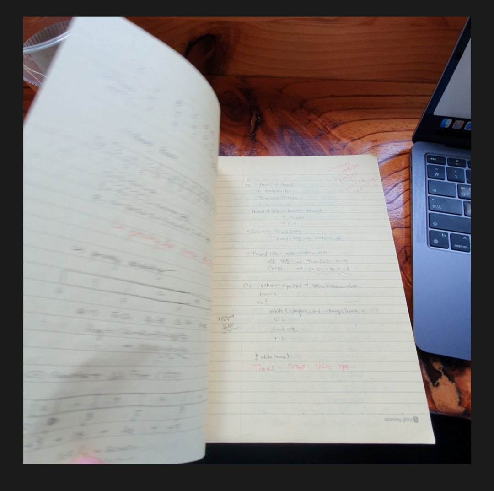
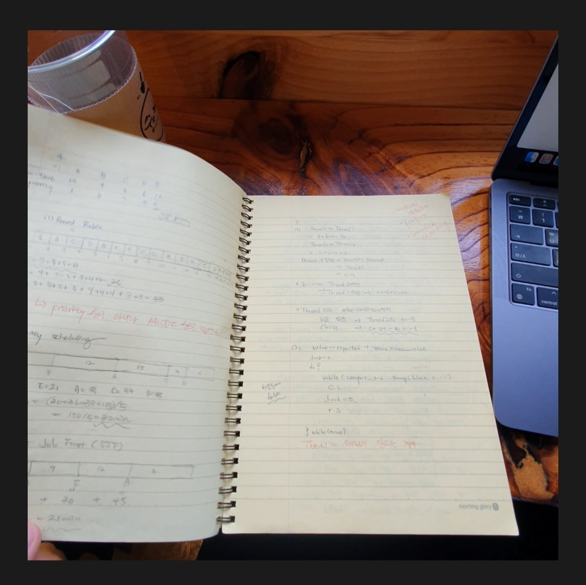
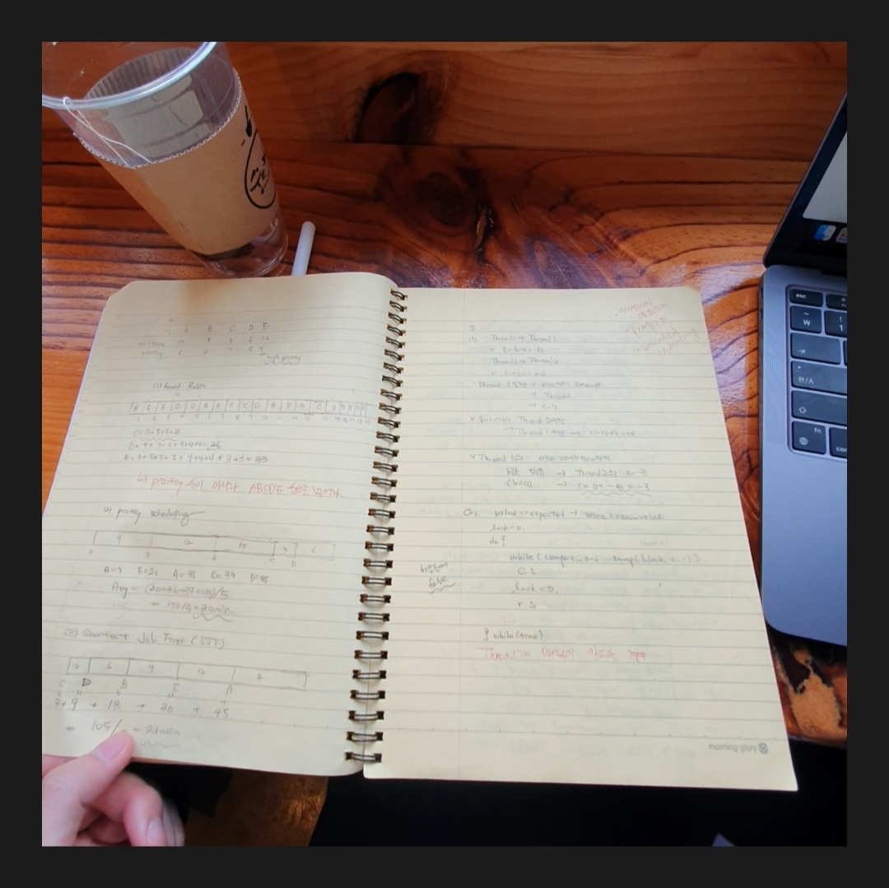

# Project - Video Scanner
---
## 1. 프로젝트 선정 이유

휴대폰으로 책을 스캔하기 위해서는 페이지마다 한장씩 사진을 찍어야하는 번거로움이 있습니다.  
이러한 불편함을 해소하기 위해, **페이지를 넘기는 영상을 촬영하면 이를 자동으로 스캔하여 문서로 변환**해주는 프로젝트로 진행해보고 싶습니다.
 
## 2. 프로젝트 목표
* 책을 넘기는 모습을 촬영하여 다수의 페이지를 손쉽게 스캔
* 영상속에서 페이지가 완전히 넘어간 시점이나 페이지를 가장 인식하기 좋은 시점을 파악하는 인공지능 모델 개발
* OCR 기능을 이용하여 PDF를 텍스트로 변환

## 3. 프로젝트에 필요한 기술
1) 영상에서 페이지 스캔을 진행할 시점을 선택할 수 있는 AI 개발

 

**스캔 되면 안되는 시점**

 

**스캔 되면 안되는 시점**

 

**스캔이 진행되어야 하는 시점**
